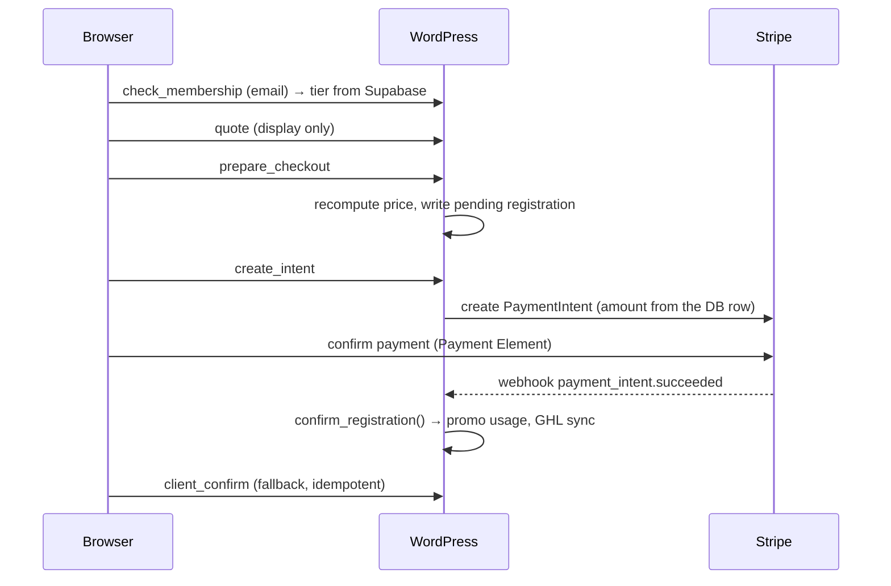

# Event Registration

A single-purpose WordPress plugin that runs paid event registration end to end:
an embedded Stripe checkout on the site's own page, membership-tier pricing
looked up from Supabase, optional installment plans, and a two-way push into a
GoHighLevel sales pipeline.

It is a bespoke plugin for one organisation — not a distributable product. It is
installed by uploading a zip, it is not listed on wordpress.org, and it makes no
attempt to be generic.

**Current version: 1.21.1.** This document orients a developer reading the code;
`event-registration/README.md` is the operator-facing "how to use it" guide.

---

## At a glance

| | |
| --- | --- |
| Type | WordPress plugin, single directory, installed from a zip |
| Dependencies | **None.** No Composer, no npm, no bundler, no build step |
| Third-party SDKs | None — Stripe, GoHighLevel and Supabase are called over plain REST with `wp_remote_*` |
| Storage | Two custom tables (not custom post types) |
| Front end | `assets/js/checkout.js` and `assets/js/staff.js`, both vanilla; Stripe.js is the only external script |
| Admin | `assets/js/admin.js`, jQuery + `wp-color-picker` + `jquery-ui-sortable` |
| Requires | WordPress 5.8+ (the header uses `Update URI`). No PHP floor is declared; the code uses 7.x-era syntax throughout |
| Entry point | `event-registration.php` — requires every class, then `init()`s them on `plugins_loaded` |

Everything is procedural-ish PHP in static classes. There is no autoloader, no
dependency injection and no test suite; each class is `require_once`d in order
and calls into the others directly by name.

---

## What it actually does

An **event** is a row with a JSON config blob: its tickets and add-ons, pricing
windows, membership discounts, promo codes, custom form fields, GoHighLevel
pipeline mapping, waitlist rules, payment-plan terms and per-event appearance.
Events are edited in wp-admin and dropped onto a page with a shortcode.

A **registration** is a row capturing one person's answers, what they were
charged, how they paid, and how far the GoHighLevel sync got.

Around that core sit the things that make it non-trivial:

- **Server-authoritative pricing.** The browser gets quotes for display only;
  every amount is recomputed from the event config at payment time.
- **Membership discounts** resolved by an email lookup against Supabase, so a
  member is recognised without logging in anywhere.
- **Time-based pricing periods** (stacked early-bird windows) that interact with
  membership discounts under an explicit "never stack, larger wins" rule.
- **Payment plans** — first installment charged on the page, the rest collected
  by a daily cron as Stripe invoices, with early payoff and cancellation.
- **Pipeline sync** that moves one GoHighLevel opportunity through stages as the
  registration's state changes, rather than creating duplicates.
- **Manual registration** for people invoiced outside the system, via three
  entry points that share one implementation.
- **Test/live Stripe switching** per event, so one event can run in the sandbox
  while the rest take real money on the same site.

---

## Architecture

`event-registration.php` defines constants, requires all 13 classes, registers
activation/deactivation hooks and cron schedules, then initialises on
`plugins_loaded` (which also runs the schema upgrade check).

| Class | File | Responsibility |
| --- | --- | --- |
| `EVR_DB` | `class-evr-db.php` | Schema, all SQL, event/registration accessors, conditional-field evaluation |
| `EVR_Settings` | `class-evr-settings.php` | Global options, Stripe mode resolution, appearance token resolution |
| `EVR_Pricing` | `class-evr-pricing.php` | **The money.** Quote computation, pricing periods, promo validation, registration windows, waitlist state |
| `EVR_Stripe` | `class-evr-stripe.php` | Stripe REST client, webhook signature verification |
| `EVR_Supabase` | `class-evr-supabase.php` | Membership tier lookup over PostgREST |
| `EVR_GHL` | `class-evr-ghl.php` | GoHighLevel v2 client, contact/opportunity sync, stage routing, abandoned-cart sweep |
| `EVR_Installments` | `class-evr-installments.php` | Payment-plan schedule, the charging sweep, payoff, cancellation |
| `EVR_Ajax` | `class-evr-ajax.php` | Public checkout endpoints, admin helper endpoints, CSV export |
| `EVR_Webhook` | `class-evr-webhook.php` | Stripe webhook route; `confirm_registration()`, the single confirmation path |
| `EVR_Admin` | `class-evr-admin.php` | All of wp-admin: events list, event editor, registrations list, settings |
| `EVR_Shortcode` | `class-evr-shortcode.php` | Public form shell + the localized config the front end reads |
| `EVR_Staff` | `class-evr-staff.php` | Password-gated staff form for manual registrations |
| `EVR_Manual` | `class-evr-manual.php` | Shared implementation behind all three manual-registration entry points |

**The two files that matter most in review** are `class-evr-pricing.php` (it
decides what people are charged) and `class-evr-installments.php` (it charges
cards off-session, on a schedule, without a human watching).

---

## Data model

Two tables, versioned by `EVR_DB::SCHEMA_VERSION` and applied with `dbDelta`.
Migrations are additive only — columns are added, nothing is dropped or
rewritten — and the upgrade runs automatically on `plugins_loaded` whenever the
stored version differs.

**`{prefix}evr_events`** — `id`, `title`, `status` (`draft|active|closed`),
`config` (LONGTEXT JSON), timestamps.

Everything configurable about an event lives in that JSON blob, merged over
`EVR_DB::default_config()` on read. That keeps schema churn to almost nothing at
the cost of no queryability inside a config — acceptable here, since events are
counted in dozens and always loaded whole.

**`{prefix}evr_registrations`** — one row per person per event. Contact fields,
resolved `tier`, ticket/add-ons, custom field answers and UTM tags as JSON,
`amount_cents`/`amount_paid_cents`, the Stripe identifiers, `plan_status` plus
the `payment_plan` schedule JSON, the GoHighLevel identifiers and sync state,
and the manual-entry columns (`source`, `payment_state`, `added_by`,
`admin_note`).

`status` is the master state: `pending → confirmed`, or `failed`, `refunded`,
`waitlist`. A `pending` row is created *before* Stripe is touched, so an
abandoned checkout is still a record the abandoned-cart sweep can act on.

---

## Request flows

### Public checkout



Two details worth understanding:

- **The PaymentIntent is created late, deliberately.** `prepare_checkout` writes
  the registration but touches nothing in Stripe; the intent is minted only when
  someone actually submits payment. Abandoned form-fills therefore leave no
  Incomplete PaymentIntents littering the Stripe dashboard. A retried card
  reuses the existing intent rather than minting a second one.
- **The webhook is authoritative; the client confirm is a backstop.** Both funnel
  into `EVR_Webhook::confirm_registration()`, which is idempotent and is the
  *only* place a registration becomes `confirmed`.

### Payment plans

The first installment is a normal on-page payment with `setup_future_usage`, so
the card is saved to a Stripe Customer and made their default. Installments 2+
are issued on their due dates by the daily `evr_installment_sweep` as
`charge_automatically` invoices — which hands Stripe the retries, dunning emails
and hosted payment page instead of reimplementing them.

Consequences a reviewer should hold onto: a missed cron run never drops a
payment (the sweep picks up anything past due on the next run); only
`invoice.marked_uncollectible` defaults a plan; and an outstanding payoff
invoice pauses the sweep until it is paid or voided.

### Manual registration

Three entry points — the admin panel, the staff shortcode page, and a REST
endpoint — all call `EVR_Manual::create()`, which writes a `pending` row and
then runs it through the same `confirm_registration()` as a paid registration.
Only `source` differs. Nothing in this path touches Stripe.

---

## Trust boundaries

Every externally reachable entry point and what guards it:

| Surface | Actions | Guard |
| --- | --- | --- |
| Public AJAX | `evr_check_membership`, `evr_quote`, `evr_prepare_checkout`, `evr_create_intent`, `evr_register_free`, `evr_client_confirm`, `evr_join_waitlist` | `evr_public` nonce; all amounts recomputed server-side |
| Staff AJAX | `evr_staff_config`, `evr_staff_register` | `evr_staff` nonce + HMAC-signed page token + page-password (or login) check + per-IP throttle |
| Admin AJAX | Stripe/GHL lookups, GHL retry, portal link, payoff, installment cancel, mark-paid | `manage_options` **and** `evr_admin` nonce |
| `admin_post` | Save/delete event, delete registration, add registration, save settings, CSV export | `manage_options` **and** nonce |
| REST | `POST evr/v1/stripe-webhook` | Stripe signature, `hash_equals` against either the live or test signing secret |
| REST | `POST evr/v1/manual-registration` | Shared key compared with `hash_equals`; blank key disables the route entirely |

Principles the code holds to, worth checking are still true after any change:

- **The browser never decides an amount.** Quotes are display-only; `create_intent`
  reads the amount from the stored registration row, never from the request.
- **The browser never decides a membership tier.** It is always re-looked-up from
  the email server-side, even though the front end also queries it for display.
- **All SQL lives in `EVR_DB`**, every dynamic value goes through
  `$wpdb->prepare()`, and writes use `$wpdb->insert/update/delete`.
- **The staff form's page identity is signed**, not passed as a bare post ID —
  otherwise the password check could be pointed at any unprotected page.
- The Supabase service-role key and Stripe secret keys are server-side only and
  never reach the localized front-end config.

---

## Integrations

**Stripe.** Direct REST calls, no SDK. Test and live keys are both stored, and
the active mode is a global setting that any event can override — so a draft
event can run through the sandbox on a live site. Tickets store a product ID for
*both* catalogs, so flipping an event's mode needs no re-picking. Webhooks are
accepted if they verify against either mode's signing secret.

**GoHighLevel** (API v2). A registration upserts a contact, then creates or
updates a single opportunity whose pipeline stage is derived from the
registration's state — waitlist, abandoned cart, registered, outstanding
payment, fully paid. Because it *updates* rather than recreates, an abandoned
cart that later pays moves stage instead of duplicating.

One non-obvious rule: **tags are never sent in the contact upsert body.** That
field replaces the contact's entire tag array, which silently wiped tags set by
workflows or by other events. They go through the additive
`POST /contacts/{id}/tags` endpoint instead, which is idempotent and therefore
safe across the several re-syncs a registration triggers.

**Supabase.** A single PostgREST query resolving an email to a membership tier,
with table and column names configurable. Tier strings like "Premium Processor"
normalise down to their base tier.

---

## Background jobs

| Hook | Schedule | Job |
| --- | --- | --- |
| `evr_abandoned_cart_sweep` | hourly | Push registrations still `pending` after 24h into the event's abandoned-cart stage. Each is pushed once — the stamped opportunity ID excludes it next time |
| `evr_installment_sweep` | daily | Issue and charge any payment-plan installment that has come due |

Both are WP-Cron, which is traffic-driven, so the site is additionally pinged by
an external cron service to guarantee same-day charging. The sweeps are
idempotent and safe to run concurrently with that.

---

## Extension points

```
Actions:  evr_registration_confirmed  ( $reg_id, $reg )
          evr_waitlist_joined         ( $reg_id )
          evr_manual_registration_added ( $reg_id, $payment_state, $source )
          evr_plan_completed          ( $reg_id )
          evr_installment_failed      ( $reg_id, $index, $error )

Filters:  evr_abandoned_cart_delay    ( default DAY_IN_SECONDS )
          evr_payoff_days_until_due   ( default 7 )
          evr_plan_max_attempts       ( default 3 )
          evr_webhook_endpoint_url    ( default: the pinned production URL )
```

There is no email sending anywhere in the plugin — receipts and dunning are left
to Stripe. `evr_registration_confirmed` is the hook to use if that changes.

---

## Decisions worth knowing before you judge the code

- **The Stripe webhook URL is pinned to production** (`EVR_Webhook::ENDPOINT_URL`)
  rather than derived from `rest_url()`, so staging installs display and use the
  real endpoint instead of silently configuring their own. Staging overrides it
  with an `EVR_WEBHOOK_URL` constant.
- **`Update URI: false` is in the plugin header.** The slug `event-registration`
  is unclaimed on wordpress.org; without this, a future plugin published at that
  slug could make WordPress offer a bogus "update" that overwrites this one.
- **The plugin folder must not be renamed.** WordPress keys `active_plugins` on
  the folder path, so a rename silently deactivates it — taking down the public
  form and the webhook route until it is reactivated.
- **Config-as-JSON over more tables** — see *Data model* above.
- **Stripe invoices over subscription schedules** for installments: it reuses
  Stripe's dunning, retries and hosted pages, and was a far smaller change than
  moving plans onto subscription schedules.
- **No build step, by choice.** The plugin is installed by hand-uploading a zip;
  a toolchain would add friction to every change for no benefit at this size.
  `EVR_VERSION` is bumped on every release and cache-busts the enqueued assets.

---

## Repository layout

```
event-registration/          the plugin — this folder is what ships
  event-registration.php     bootstrap, constants, cron registration
  includes/                  13 classes, one file each
  assets/{js,css}/           checkout, staff, admin
  README.md                  operator guide (ships with the plugin)
event-registration.zip       the installable build
README.md                    this file
CLAUDE.md                    working notes: decisions, staging gotchas, open items
```

Only `event-registration/` goes into the zip. Releases bump the version in two
places that must stay in sync — the `Version:` header and the `EVR_VERSION`
constant — since the constant is what cache-busts the front-end assets.

---

## Known limitations

- **No automated tests, and no local runtime** for this project. Everything is
  verified on a staging site against Stripe test keys, which means changes reach
  review unrun. Treat the pricing and installment paths accordingly.
- **No email of its own.** If Stripe's receipts and dunning ever stop being
  enough, that is new work, not configuration.
- **Capacity is advisory under concurrency.** Seats count confirmed rows plus
  pending ones under an hour old; there is no lock, so a true race at the
  capacity boundary can oversell by one.
- **GoHighLevel failures are recorded, not retried automatically.** A failed sync
  marks the row and surfaces a retry button in the admin.

## A note on security scanners

Wordfence flags this plugin as **CVE-2010-4839, "Event Registration < 6.00.03 —
SQL Injection"**. It is a false positive: Wordfence matches on folder slug plus
version, and the actual vulnerable product is an unrelated 2010 plugin that
happened to use the same slug. The finding is slug-based, so no code change can
clear it — it is marked ignored in the Wordfence dashboard. The code was audited
for that bug class independently and is clean.
